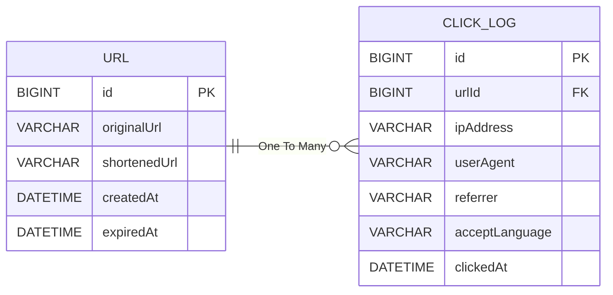

# URL Shortener System
> 대규모 트래픽 환경에서의 **성능 개선, 새로운 기술 스택 실험, 트레이드오프(Trade-off) 기반의 기술 판단, 그리고 확장성 있는 아키텍처 설계 역량 강화**를 목표로 한 사이드 프로젝트

## 0. 프로젝트 개요

이 프로젝트는 Bitly처럼 긴 URL을 짧게 변환해주는 **URL 단축 서비스**를 직접 구현한 것입니다.

단순히 “짧은 링크를 만드는 기능”에 그치지 않고, 제한된 서버 자원에서 인기를 얻어 트래픽이 폭증하는 상황을 가정하고

- 수직적 확장(Scale-up)이 아닌 수평적 확장(Scale-out) 중심의 설계
- 유연하고 확장성 있는 코드 작성
- 수치로 증명하는 성능 개선
- 가용성과 확장성을 고려한 시스템 설계
- 트레이드오프에 기반한 기술 채택

같은 요소들을 목표로 합니다.

**키워드:** 디자인 패턴, 가용성(Availability), 확장성(Scalability), 트레이드오프(Trade-off), Kafka, Redis, 부하 테스트

## 1. 기술 스택

| 구분                   | 사용 기술                             |
| -------------------- |-----------------------------------|
| **Backend**          | Java 17, Spring Boot, Spring Data JPA |
| **Database / Cache** | MySQL, Redis                      |
| **DevOps / Infra**   | AWS (EC2, RDS, MKS 등), Docker     |
| **Test / Load**      | JUnit5, Locust, k6                |
| **ETC**              | Kafka                             |

## 2. 기능 요구사항
### 2.1 URL 단축 기능
- 입력
  - 사용자는 원본 URL을 입력한다.
- 처리
  - 시스템은 입력된 URL의 유효성을 검증한다. (e.g., http:// 또는 https://로 시작)
  - 고유하고 충돌 없는 짧은 키(Short Key)를 생성한다. (예: aB1cD2e)
  - 원본 URL과 짧은 키를 데이터베이스에 매핑하여 저장한다.
- 출력
  - 생성된 전체 단축 URL을 사용자에게 반환한다. (예: https://jeonsonghun.com/aB1cD2e)
- 제약 조건 
  - 이미 단축된 자체 서비스 URL은 다시 단축할 수 없다. (무한 리다이렉션 방지)

### 2.2 단축 URL 리다이랙션 기능
- 입력
  - 사용자가 브라우저를 통해 단축 URL에 접속한다.
- 처리
  - 시스템은 URL의 짧은 키를 파싱하여 데이터베이스에서 원본 URL을 조회한다.
  - 해당 키가 존재하면, 원본 URL로 HTTP 301 Moved Permanently 리다이렉션을 수행한다.
  - 해당 키가 존재하지 않으면, 404 Not Found 페이지를 반환한다.
- 부가 처리
  - 리다이렉션이 성공할 때마다 '클릭 로그'를 기록한다.

### 2.3 단축 URL 클릭 로그 기록 및 통계 조회 기능
- 로그 기록
  - 리다이렉션이 발생할 때마다 다음 정보를 수집하여 별도의 로그 저장소나 메시지 큐로 전송한다.
    - 단축 키 (Short Key)
    - 클릭 발생 시간 (Timestamp)
    - 접속 IP 주소 (IP Address)
    - 사용자 환경 정보 (User-Agent)
    - 유입 경로 (Referrer)
- 통계 조회
  - 사용자는 자신이 생성한 단축 URL의 통계 데이터를 조회할 수 있다.
  - 제공 데이터
    - 총 클릭 수: 해당 URL이 리다이렉션된 전체 횟수
    - 시간별 클릭 수: 일별 또는 시간별 클릭 수 추이 (그래프 시각화)
    - 유입 경로(Referrer) TOP 5: 어떤 웹사이트를 통해 유입되었는지 상위 5개 표시
    - 사용자 환경(User-Agent) 분석: 브라우저 종류, 운영체제(OS)별 접속 비율

## 3. 비기능 요구사항

### 3.1. 성능 (Performance)
- 리다이렉션 응답 시간: 사용자가 단축 URL을 요청했을 때, 서버의 처리 시간은 99 percentile 기준 100ms 이내여야 한다.
- URL 생성 응답 시간: 사용자가 URL 단축을 요청했을 때, 서버의 처리 시간은 99 percentile 기준 200ms 이내여야 한다.
- 동시 처리량: 초당 1,000건(TPS)의 리다이렉션 요청을 안정적으로 처리할 수 있어야 한다.
### 3.2. 가용성 (Availability)
- 서비스는 99.9%의 가용성을 목표로 한다. (연간 장애 시간 8.77시간 미만)
- ID 생성기(e.g., Redis) 또는 데이터베이스 장애 시 서비스 중단을 최소화하는 방안을 고려한다.
### 3.3. 확장성 (Scalability)
- 애플리케이션 서버는 Stateless하게 설계하여 수평적 확장(Scale-out)이 용이해야 한다.
- 트래픽 증가에 따라 데이터베이스와 캐시 서버를 손쉽게 증설할 수 있는 구조를 가진다.
### 3.4. 데이터 무결성
- 한번 생성된 단축 URL은 삭제되지 않는 한 항상 원래의 URL로 정확하게 리다이렉션되어야 한다.
- 클릭 로그 데이터의 손실을 최소화해야 한다.

## 4. ERD

