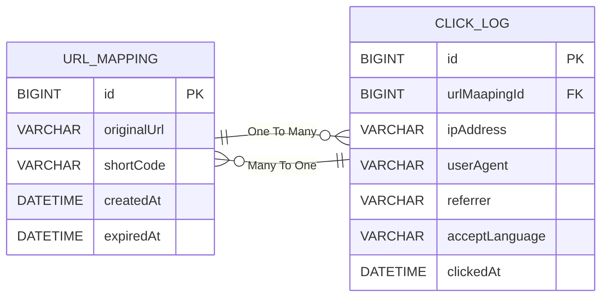

# URL Shortener System
> 대규모 트래픽 환경에서의 **성능 개선, 새로운 기술 스택 실험, 트레이드오프(Trade-off) 기반의 기술 판단, 그리고 확장성 있는 아키텍처 설계 역량 강화**를 목표로 한 사이드 프로젝트

## 0. 프로젝트 개요

이 프로젝트는 Bitly처럼 긴 URL을 짧게 변환해주는 **URL 단축 서비스**를 직접 구현한 것입니다.

단순히 “짧은 링크를 만드는 기능”에 그치지 않고, 제한된 서버 자원에서 인기를 얻어 트래픽이 폭증하는 상황을 가정하고

- 수직적 확장(Scale-up)이 아닌 수평적 확장(Scale-out) 중심의 설계
- 유연하고 확장성 있는 코드 작성
- 수치로 증명하는 성능 개선
- 가용성과 확장성을 고려한 시스템 설계
- 트레이드오프에 기반한 기술 채택

같은 요소들을 목표로 합니다.

### 0.1 기술 스택
| 구분                   | 사용 기술                             |
| -------------------- |-----------------------------------|
| **Backend**          | Java, Spring Boot, Spring Data JPA |
| **Database / Cache** | MySQL, Redis                      |
| **DevOps / Infra**   | Docker     |
| **Test / Load**      | JUnit5, JMeter                |

## 1. 시스템 아키텍처

## 2. 주요 기능 및 기술적 도전 과제
### 2.1 디자인 패턴을 활용한 유연하고 확장성 있는 설계
단순히 기능 요구사항을 만족시키는 코드를 넘어, 향후 변경에 유연하게 대처하고 유지보수 비용을 낮출 수 있는 구조를 설계하는 것을 목표로 했습니다. 이를 위해 두 가지 주요 디자인 패턴을 적용했습니다.
#### 1) 전략 패턴(Strategy Pattern)을 통한 ID 생성 방식의 유연한 교체
- 도전 과제 
  - URL 단축기의 핵심인 고유 ID 생성 방식은 시스템 환경에 따라 최적의 전략이 다르다.
  - 분산/운영 환경: 여러 서버에서 동시에 ID를 생성해도 충돌이 없어야 하니 중앙화된 Redis의 INCR 같은 원자적 연산 필요.
  - 로컬/개발 환경: 간단한 테스트를 위해 외부 의존성(Redis) 없이 메모리 기반으로 빠르게 동작하는 방식이 효율적.
- 해결 방안
  - 전략 패턴(Strategy Pattern)을 적용하여 ID 생성 로직을 추상화.
  - IdSupplier 라는 인터페이스를 정의하고, 실제 생성 로직을 담은 구현체(RedisIdSupplier, InMemoryIdSupplier)를 추가.
  - 서비스 로직은 IdSupplier 인터페이스에만 의존하며, 실제 어떤 구현체를 사용할지는 Spring의 Profile(@Profile)이나 환경설정(application.yml)을 통해 외부에서 주입하도록 설계.
- 기대 효과
  - 유연성 및 테스트 용이성: 운영 환경과 개발 환경의 ID 생성 전략을 코드를 수정하지 않고 손쉽게 전환 가능.
  - OCP(개방-폐쇄 원칙) 준수: 새로운 ID 생성 방식(ex. DatabaseIdSupplier)이 필요할 경우, 기존 코드를 수정하지 않고 IdSupplier의 새로운 구현체만 추가하면 되므로 용이한 확장성.
#### 2) 책임 연쇄 패턴(Chain-of-Responsibility)을 통한 검증 로직의 확장
- 도전 과제
  - URL 단축 요청, 리다이랙션 요청이 들어왔을 때 여러 검증 과정을 거쳐야 함.
  - 예를 들어, URL 형식 검증, 자체 URL 순환 단축(무한 리다이랙션) 방지 검증, 블랙리스트 검증 등 다양한 규칙이 필요할 수 있다. 이러한 검증 로직이 서비스 코드 내에 if-else 블록으로 얽혀있다면, 새로운 검증 규칙을 추가하거나 순서를 변경하기가 매우 어렵고 복잡해 질 것임.
- 해결 방안
  - 책임 연쇄 패턴(Chain-of-Responsibility)을 도입하여 각 검증 로직을 독립적인 객체로 분리.
  - 모든 검증 객체가 구현해야 하는 ValidationHandler 인터페이스를 정의.
  - UrlFormatValidator, CircularShorteningValidator 등 각 검증 책임을 가진 구체적인 핸들러 클래스를 구현.
  - 이 핸들러들을 체인(Chain)으로 연결하여, 요청이 들어오면 체인의 첫 번째 핸들러부터 순서대로 검증을 수행하도록 구성했음. 각 핸들러는 검증을 통과하면 다음 핸들러로 요청을 전달하고, 실패하면 즉시 처리를 중단.
- 기대 효과
  - SRP(단일 책임 원칙) 준수: 각 검증 로직이 별도의 클래스로 분리되어 코드의 가독성과 유지보수성이 향상.
  - 유연한 확장 및 재구성: 새로운 검증 규칙이 필요할 때 새로운 핸들러 클래스를 구현하여 체인에 추가하기만 하면 된다. 또한, 설정 파일을 통해 검증 순서를 동적으로 변경하는 것도 가능해져 비즈니스 요구사항 변화에 유연하게 대응 가능.
## 3. 기능 요구사항 정리
### 3.1 URL 단축 기능
- 입력
  - 사용자는 원본 URL을 입력한다.
- 처리
  - 시스템은 입력된 URL의 유효성을 검증한다. (e.g., http:// 또는 https://로 시작)
  - 고유하고 충돌 없는 코드(Short Code)를 생성한다. (예: aB1cD2e)
  - 원본 URL과 짧은 키를 데이터베이스에 매핑하여 저장한다.
- 출력
  - 생성된 전체 단축 URL을 사용자에게 반환한다. (예: https://jeonsonghun.com/aB1cD2e)
- 제약 조건 
  - 이미 단축된 자체 서비스 URL은 다시 단축할 수 없다. (무한 리다이렉션 방지)
### 3.2 단축 URL 리다이랙션 기능
- 입력
  - 사용자가 브라우저를 통해 단축 URL에 접속한다.
- 처리
  - 시스템은 URL의 PathVariable의 ShortCode를 파싱하여 데이터베이스에서 원본 URL을 조회한다.
  - 해당 ShortCode가 존재하면, 원본 URL로 HTTP 301 Moved Permanently 리다이렉션을 수행한다.
  - 해당 ShortCode가 존재하지 않으면, 404 Not Found 페이지를 반환한다.
- 부가 처리
  - 리다이렉션이 성공할 때마다 '클릭 로그'를 기록한다.
### 3.3 단축 URL 클릭 로그 기록 및 통계 조회 기능
- 로그 기록
  - 리다이렉션이 발생할 때마다 다음 정보를 수집하여 별도의 로그 저장소나 메시지 큐로 전송한다.
    - 단축 코드 (ShortCode)
    - 클릭 발생 시간 (Timestamp)
    - 접속 IP 주소 (IP Address)
    - 사용자 환경 정보 (User-Agent)
    - 유입 경로 (Referrer)
- 통계 조회
  - 사용자는 자신이 생성한 단축 URL의 통계 데이터를 조회할 수 있다.
  - 제공 데이터
    - 총 클릭 수: 해당 URL이 리다이렉션된 전체 횟수
    - 시간별 클릭 수: 일별 또는 시간별 클릭 수 추이 (그래프 시각화)
    - 유입 경로(Referrer) TOP 5: 어떤 웹사이트를 통해 유입되었는지 상위 5개 표시
    - 사용자 환경(User-Agent) 분석: 브라우저 종류, 운영체제(OS)별 접속 비율

## 4. ERD

